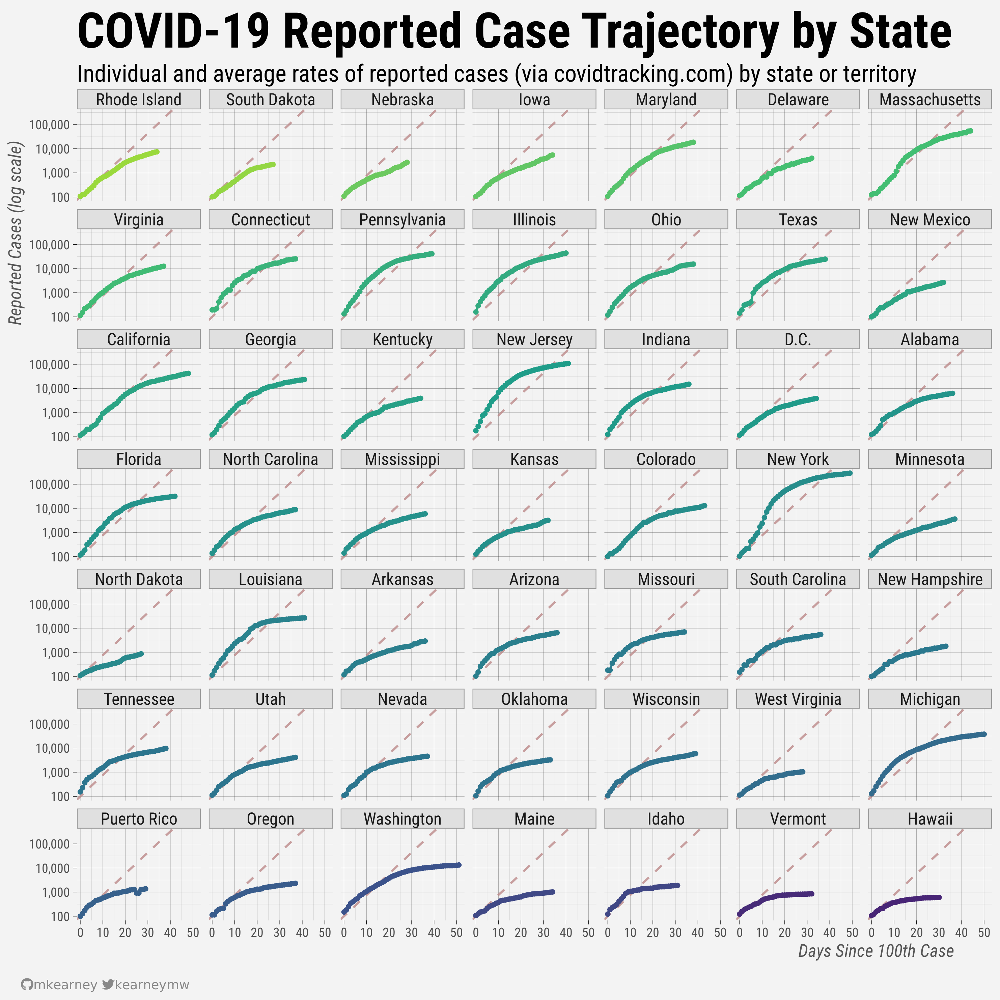

<!-- README.md is generated from README.Rmd. Please edit that file -->

# covid19

<!-- badges: start -->

[](https://www.tidyverse.org/lifecycle/#experimental)
[](https://CRAN.R-project.org/package=covid19)
[](https://github.com/mkearney/covid19/commits/master)
[](https://github.com/mkearney/covid19)
<!-- badges: end -->

An API wrapper for [covidtracking.com](https://covidtracking.com/api/).

## Installation

You can install the from Github with

``` r
remotes::install_github("mkearney/covid19")
```

## Endpoints

Endpoint functions calls all follow the convention of
`covid19_{endpoint}`. Exported functions and examples of output data are
grouped by similar endpoints and included below.

### U.S.

  - **`covid19_us()`**: Counts (`positive`, `negative`, `pos_neg`
    (positive + negative), `hospitalized`, `death`, `total`) for entire
    the U.S.
    
    ``` r
    covid19_us()
    #> # A tibble: 1 x 18
    #>   positive negative pending hospitalized_cu… hospitalized_cu… in_icu_currently
    #>      <int>    <int>   <int>            <int>            <int>            <int>
    #> 1  1479856 10019347    3449            41108           156905            10164
    #> # … with 12 more variables: in_icu_cumulative <int>,
    #> #   on_ventilator_currently <int>, on_ventilator_cumulative <int>,
    #> #   recovered <int>, hash <chr>, last_modified <dttm>, death <int>,
    #> #   hospitalized <int>, total <int>, total_test_results <int>, pos_neg <int>,
    #> #   notes <chr>
    ```

  - **`covid19_us_daily()`**: Counts (`positive`, `negative`, `pos_neg`
    (positive + negative), `hospitalized`, `death`, `total`, `states`)
    by day
    
    ``` r
    covid19_us_daily()
    #> # A tibble: 117 x 24
    #>    date       states positive negative pending hospitalized_cu… hospitalized_cu…
    #>    <date>      <int>    <int>    <int>   <int>            <int>            <int>
    #>  1 2020-05-17     56  1479856 10019347    3449            41108           156905
    #>  2 2020-05-16     56  1458787  9618392    3788            42896           155726
    #>  3 2020-05-15     56  1433696  9286489    2457            42854           153866
    #>  4 2020-05-14     56  1407507  8934268    2673            44317           152396
    #>  5 2020-05-13     56  1382304  8592527    1983            44514           149347
    #>  6 2020-05-12     56  1361884  8288521    1803            45199           147250
    #>  7 2020-05-11     56  1340412  8008046    1989            44191           145981
    #>  8 2020-05-10     56  1322807  7637355    3095            44943           144780
    #>  9 2020-05-09     56  1301095  7385405    3054            46637           143762
    #> 10 2020-05-08     56  1275916  7114090    3307            47718           142037
    #> # … with 107 more rows, and 17 more variables: in_icu_currently <int>,
    #> #   in_icu_cumulative <int>, on_ventilator_currently <int>,
    #> #   on_ventilator_cumulative <int>, recovered <int>, hash <chr>,
    #> #   date_checked <dttm>, death <int>, hospitalized <int>, total <int>,
    #> #   total_test_results <int>, pos_neg <int>, death_increase <int>,
    #> #   hospitalized_increase <int>, negative_increase <int>,
    #> #   positive_increase <int>, total_test_results_increase <int>
    ```

### States

  - **`covid19_states()`**: Counts (`positive`, `negative`,
    `hospitalized`, `death`, `pending`, `total`) and grades
    (`positive_score`, `negative_score`, `grade`, `score`) by state
    
    ``` r
    covid19_states()
    #> # A tibble: 56 x 30
    #>    state positive positive_score negative_score negative_regula…
    #>    <chr>    <int>          <int>          <int>            <int>
    #>  1 AK         396              1              1                1
    #>  2 AL       11771              1              1                0
    #>  3 AR        4759              1              1                1
    #>  4 AZ       13937              1              1                0
    #>  5 CA       78839              1              1                0
    #>  6 CO       21633              1              1                1
    #>  7 CT       37419              1              1                1
    #>  8 DC        7123              1              1                1
    #>  9 DE        7670              1              1                1
    #> 10 FL       45588              1              1                1
    #> # … with 46 more rows, and 25 more variables: commercial_score <int>,
    #> #   grade <chr>, score <int>, notes <chr>, data_quality_grade <chr>,
    #> #   negative <int>, pending <int>, hospitalized_currently <int>,
    #> #   hospitalized_cumulative <int>, in_icu_currently <int>,
    #> #   in_icu_cumulative <int>, on_ventilator_currently <int>,
    #> #   on_ventilator_cumulative <int>, recovered <int>, last_update_et <chr>,
    #> #   check_time_et <chr>, death <int>, hospitalized <int>, total <int>,
    #> #   total_test_results <int>, pos_neg <int>, fips <chr>, date_modified <dttm>,
    #> #   date_checked <dttm>, hash <chr>
    ```

  - **`covid19_states_daily()`**: Counts (`positive`, `negative`,
    `pos_neg` (positive + negative), `hospitalized`, `death`, `total`)
    by day
    
    ``` r
    covid19_states_daily()
    #> # A tibble: 4,105 x 27
    #>    date       state positive negative pending hospitalized_cu… hospitalized_cu…
    #>    <date>     <chr>    <int>    <int>   <int>            <int>            <int>
    #>  1 2020-05-17 AK         396    34255      NA               13               NA
    #>  2 2020-05-17 AL       11771   144579      NA               NA             1392
    #>  3 2020-05-17 AR        4759    80426      NA               65              520
    #>  4 2020-05-17 AS           0      105      NA               NA               NA
    #>  5 2020-05-17 AZ       13937   137824      NA              796             1699
    #>  6 2020-05-17 CA       78839  1156404      NA             4291               NA
    #>  7 2020-05-17 CO       21633   103915      NA              650             3866
    #>  8 2020-05-17 CT       37419   133188      NA              937            10946
    #>  9 2020-05-17 DC        7123    29403      NA              369               NA
    #> 10 2020-05-17 DE        7670    33195      NA              229               NA
    #> # … with 4,095 more rows, and 20 more variables: in_icu_currently <int>,
    #> #   in_icu_cumulative <int>, on_ventilator_currently <int>,
    #> #   on_ventilator_cumulative <int>, recovered <int>, data_quality_grade <chr>,
    #> #   last_update_et <chr>, hash <chr>, date_checked <dttm>, death <int>,
    #> #   hospitalized <int>, total <int>, total_test_results <int>, pos_neg <int>,
    #> #   fips <chr>, death_increase <int>, hospitalized_increase <int>,
    #> #   negative_increase <int>, positive_increase <int>,
    #> #   total_test_results_increase <int>
    ```

  - **`covid19_states_info()`**: State government links, Twitter
    accounts, notes, etc.
    
    ``` r
    covid19_states_info()
    #> # A tibble: 56 x 10
    #>    state covid19site_old covid19site covid19site_sec… twitter pui   pum   notes
    #>    <chr> <chr>           <chr>       <chr>            <chr>   <chr> <lgl> <chr>
    #>  1 AK    http://dhss.al… http://dhs… http://dhss.ala… @Alask… All … FALSE "Tot…
    #>  2 AL    http://www.ala… https://al… https://dph1.ad… @alpub… No d… FALSE "Neg…
    #>  3 AR    https://www.he… https://ww… https://adem.ma… @adhpio All … TRUE   <NA>
    #>  4 AS    http://www.sam… https://ww… https://www.fac… <NA>    No D… FALSE "Our…
    #>  5 AZ    https://www.az… https://ww… https://www.azd… @azdhs  All … FALSE "Das…
    #>  6 CA    https://www.cd… https://ww… https://www.cdp… @CAPub… Only… FALSE "Cal…
    #>  7 CO    https://www.co… https://co… <NA>             @cdphe  Posi… FALSE "Neg…
    #>  8 CT    https://portal… https://da… <NA>             @ctdph  All … FALSE "Neg…
    #>  9 DC    https://corona… https://co… <NA>             @_DCHe… All … FALSE "Pos…
    #> 10 DE    https://dhss.d… https://dh… <NA>             @Delaw… All … TRUE  "As …
    #> # … with 46 more rows, and 2 more variables: fips <chr>, name <chr>
    ```



### Counties

  - **`covid19_counties()`**: County-level links for government sites,
    Twitter accounts, etc.
    
    ``` r
    covid19_counties()
    #> # A tibble: 11 x 7
    #>    state county   covid19site               data_site main_site   twitter pui   
    #>    <chr> <chr>    <chr>                     <lgl>     <chr>       <lgl>   <chr> 
    #>  1 CA    Los Ang… http://publichealth.laco… NA        <NA>        NA      No da…
    #>  2 NY    Westche… https://health.westchest… NA        <NA>        NA      No da…
    #>  3 WA    King     https://www.kingcounty.g… NA        <NA>        NA      No da…
    #>  4 WA    Snohomi… https://www.snohd.org/48… NA        <NA>        NA      All d…
    #>  5 WA    Grant    http://granthealth.org/2… NA        <NA>        NA      No da…
    #>  6 WA    Jeffers… https://www.jeffersoncou… NA        <NA>        NA      All d…
    #>  7 WA    Pierce   https://www.tpchd.org/he… NA        <NA>        NA      Only …
    #>  8 WA    Clark    https://www.clark.wa.gov… NA        <NA>        NA      All d…
    #>  9 WA    Kittitas https://www.co.kittitas.… NA        <NA>        NA      No da…
    #> 10 CA    Contra … https://www.coronavirus.… NA        https://cc… NA      <NA>  
    #> 11 CA    Alameda… http://www.acphd.org/201… NA        http://www… NA      <NA>
    ```

### Other

  - **`covid19_urls()`**: Links to official state government sites
    
    ``` r
    covid19_urls()
    #> # A tibble: 56 x 6
    #>    kind  name    url                 filter               state_id ssl_no_verify
    #>    <chr> <chr>   <chr>               <chr>                <chr>    <lgl>        
    #>  1 url   Alaska  "https://services1… "css:.ftrTable,html… AK       NA           
    #>  2 url   Alabama "https://services7… "css:.ftrTable,html… AL       NA           
    #>  3 url   Arkans… "https://www.healt… "css:#contentBody t… AR       NA           
    #>  4 url   Arizona "https://tableau.a… "ocr,clean-new-line… AZ       NA           
    #>  5 url   Califo… "https://www.cdph.… "css:table:contains… CA       NA           
    #>  6 url   Colora… "https://covid19.c… "css:article .parag… CO       NA           
    #>  7 url   Connec… "https://data.ct.g… "strip"              CT       NA           
    #>  8 url   Washin… "https://coronavir… "css:ul:contains(\"… DC       NA           
    #>  9 url   Delawa… "https://myhealthy… "css:div.c-summary-… DE       NA           
    #> 10 url   Florida "https://services1… "css:.ftrTable,html… FL       NA           
    #> # … with 46 more rows
    ```

  - **`covid19_press()`**: Information (`title`, `url`, `publication`,
    `author`, etc.) about publications
    
    ``` r
    covid19_press()
    #> # A tibble: 142 x 15
    #>    title url   add_to_covid_tr… feature_on_covi… about_covid_tra…
    #>    <chr> <chr> <lgl>            <lgl>            <lgl>           
    #>  1 Geor… http… TRUE             TRUE             FALSE           
    #>  2 A St… http… TRUE             TRUE             FALSE           
    #>  3 16 S… http… TRUE             TRUE             FALSE           
    #>  4 Whit… http… TRUE             TRUE             TRUE            
    #>  5 Coro… http… TRUE             NA               FALSE           
    #>  6 Amid… http… TRUE             TRUE             NA              
    #>  7 Inst… http… TRUE             TRUE             FALSE           
    #>  8 Coro… http… TRUE             TRUE             FALSE           
    #>  9 Kans… http… TRUE             NA               FALSE           
    #> 10 Dunl… http… TRUE             NA               FALSE           
    #> # … with 132 more rows, and 10 more variables: publish_date <dttm>,
    #> #   continually_updated <lgl>, publication <chr>, author <chr>,
    #> #   does_this_source_have_a_data_visualization <lgl>, data_source <chr>,
    #> #   uses_covid_tracking_data <chr>, link_to_viz_image <chr>,
    #> #   twitter_copy <lgl>, language <chr>
    ```

  - **`covid19_screenshots()`**: Information and paths to screenshots of
    original data sources
    
    ``` r
    covid19_screenshots()
    #> # A tibble: 15,451 x 6
    #>    state url                         date_checked        secondary date     size
    #>    <chr> <chr>                       <dttm>              <lgl>     <chr>   <int>
    #>  1 AK    https://covidtracking.com/… 2020-03-15 06:13:15 FALSE     20200… 563460
    #>  2 AK    https://covidtracking.com/… 2020-03-15 20:32:25 FALSE     20200… 432003
    #>  3 AK    https://covidtracking.com/… 2020-03-16 14:53:36 FALSE     20200… 563460
    #>  4 AK    https://covidtracking.com/… 2020-03-17 03:06:10 FALSE     20200… 563522
    #>  5 AK    https://covidtracking.com/… 2020-03-17 18:09:31 FALSE     20200… 567852
    #>  6 AK    https://covidtracking.com/… 2020-03-17 22:00:17 FALSE     20200… 565619
    #>  7 AK    https://covidtracking.com/… 2020-03-18 05:00:17 FALSE     20200… 568859
    #>  8 AK    https://covidtracking.com/… 2020-03-18 18:01:15 FALSE     20200… 569429
    #>  9 AK    https://covidtracking.com/… 2020-03-18 23:00:43 FALSE     20200… 517287
    #> 10 AK    https://covidtracking.com/… 2020-03-19 05:00:25 FALSE     20200… 524988
    #> # … with 15,441 more rows
    ```
