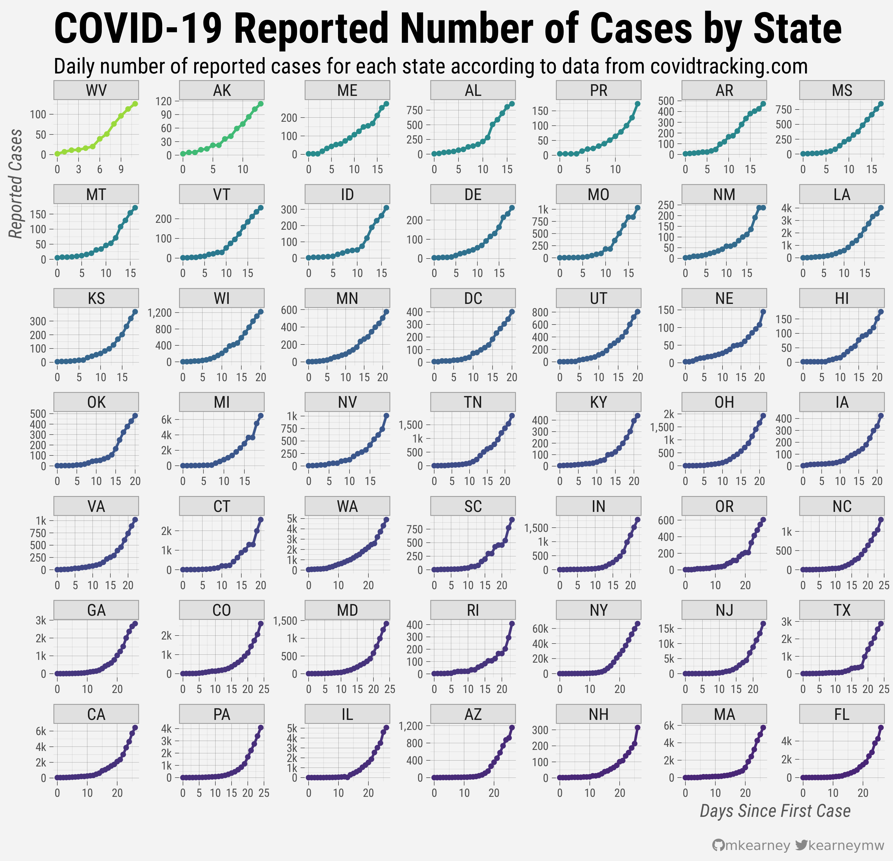

<!-- README.md is generated from README.Rmd. Please edit that file -->

# covid19

<!-- badges: start -->

[](https://www.tidyverse.org/lifecycle/#experimental)
[](https://CRAN.R-project.org/package=covid19)
[](https://github.com/mkearney/covid19/commits/master)
[](https://github.com/mkearney/covid19)
<!-- badges: end -->

An API wrapper for [covidtracking.com](https://covidtracking.com/api/).

## Installation

You can install the from Github with

``` r
remotes::install_github("mkearney/covid19")
```

## Endpoints

Endpoint functions calls all follow the convention of
`covid19_{endpoint}`. Exported functions and examples of output data are
grouped by similar endpoints and included below.

### U.S.

  - **`covid19_us()`**: Counts (`positive`, `negative`, `pos_neg`
    (positive + negative), `hospitalized`, `death`, `total`) for entire
    the U.S.
    
    ``` r
    covid19_us()
    #> # A tibble: 1 x 10
    #>   positive negative pos_neg hospitalized death  total hash  last_modified      
    #>      <int>    <int>   <int>        <int> <int>  <int> <chr> <dttm>             
    #> 1   141232   710346  851578        19839  2447 851578 8092… 2020-03-30 07:27:25
    #> # … with 2 more variables: notes <chr>, total_test_results <int>
    ```

  - **`covid19_us_daily()`**: Counts (`positive`, `negative`, `pos_neg`
    (positive + negative), `hospitalized`, `death`, `total`, `states`)
    by day
    
    ``` r
    covid19_us_daily()
    #> # A tibble: 26 x 17
    #>    date       states positive negative pos_neg pending hospitalized death  total
    #>    <date>      <int>    <int>    <int>   <int>   <int>        <int> <int>  <int>
    #>  1 2020-03-29     56   139061   692290  831351   65549        19730  2428 896900
    #>  2 2020-03-28     56   118234   617470  735704   65712        16729  1965 801416
    #>  3 2020-03-27     56    99413   527220  626633   60094        13718  1530 686727
    #>  4 2020-03-26     56    80735   438603  519338   60251        10131  1163 579589
    #>  5 2020-03-25     56    63928   357604  421532   51235         6136   900 472767
    #>  6 2020-03-24     56    51954   292758  344712   14433         4468   675 359145
    #>  7 2020-03-23     56    42152   237321  279473   14571         3325   471 294044
    #>  8 2020-03-22     56    31879   193463  225342    2842         2554   398 228184
    #>  9 2020-03-21     56    23197   155909  179106    3477         1964   272 182583
    #> 10 2020-03-20     56    17033   118147  135180    3336           NA   219 138516
    #> # … with 16 more rows, and 8 more variables: hash <chr>, date_checked <dttm>,
    #> #   total_test_results <int>, death_increase <int>,
    #> #   hospitalized_increase <int>, negative_increase <int>,
    #> #   positive_increase <int>, total_test_results_increase <int>
    ```

### States

  - **`covid19_states()`**: Counts (`positive`, `negative`,
    `hospitalized`, `death`, `pending`, `total`) and grades
    (`positive_score`, `negative_score`, `grade`, `score`) by state
    
    ``` r
    covid19_states()
    #> # A tibble: 56 x 21
    #>    state positive positive_score negative_score negative_regula…
    #>    <chr>    <int>          <int>          <int>            <int>
    #>  1 AK         114              1              1                1
    #>  2 AL         830              1              1                0
    #>  3 AR         426              1              1                1
    #>  4 AZ         919              1              1                0
    #>  5 CA        5708              1              1                1
    #>  6 CO        2307              1              1                1
    #>  7 CT        1993              1              1                1
    #>  8 DC         342              1              1                1
    #>  9 DE         232              1              1                0
    #> 10 FL        4950              1              1                1
    #> # … with 46 more rows, and 16 more variables: commercial_score <int>,
    #> #   grade <chr>, score <int>, negative <int>, pending <int>,
    #> #   hospitalized <int>, death <int>, total <int>, last_update_et <chr>,
    #> #   check_time_et <chr>, total_test_results <int>, fips <chr>,
    #> #   date_modified <dttm>, date_checked <dttm>, notes <chr>, hash <chr>
    ```

  - **`covid19_states_daily()`**: Counts (`positive`, `negative`,
    `pos_neg` (positive + negative), `hospitalized`, `death`, `total`)
    by day
    
    ``` r
    covid19_states_daily()
    #> # A tibble: 1,317 x 17
    #>    date       state positive negative pending hospitalized death total hash 
    #>    <date>     <chr>    <int>    <int>   <int>        <int> <int> <int> <chr>
    #>  1 2020-03-29 AK         102     3232      NA            6     2  3334 d4c0…
    #>  2 2020-03-29 AL         806     4184      NA           NA     4  4990 9dbf…
    #>  3 2020-03-29 AR         426     3027      NA           48     6  3453 2c8e…
    #>  4 2020-03-29 AS          NA       NA      NA           NA     0     0 f205…
    #>  5 2020-03-29 AZ         919    12953      NA           78    17 13872 14de…
    #>  6 2020-03-29 CA        5708    20549   64400         1034   123 90657 c364…
    #>  7 2020-03-29 CO        2061    11215      NA          274    44 13276 1076…
    #>  8 2020-03-29 CT        1993     9907      NA          404    34 11900 a2fc…
    #>  9 2020-03-29 DC         342     2469       1           NA     5  2812 951a…
    #> 10 2020-03-29 DE         232       36      NA           33     6   268 ba8e…
    #> # … with 1,307 more rows, and 8 more variables: date_checked <dttm>,
    #> #   total_test_results <int>, fips <chr>, death_increase <int>,
    #> #   hospitalized_increase <int>, negative_increase <int>,
    #> #   positive_increase <int>, total_test_results_increase <int>
    ```

  - **`covid19_states_info()`**: State government links, Twitter
    accounts, notes, etc.
    
    ``` r
    covid19_states_info()
    #> # A tibble: 56 x 10
    #>    state covid19site_old covid19site covid19site_sec… twitter pui   pum   notes
    #>    <chr> <chr>           <chr>       <chr>            <chr>   <chr> <lgl> <chr>
    #>  1 AK    http://dhss.al… http://dhs… http://dhss.ala… @Alask… All … FALSE "Tot…
    #>  2 AL    http://www.ala… https://al… <NA>             @alpub… No d… FALSE "Neg…
    #>  3 AR    https://www.he… https://ww… https://adem.ma… @adhpio All … TRUE  "Dat…
    #>  4 AS    http://www.sam… https://ww… https://www.fac… https:… No D… FALSE "Ame…
    #>  5 AZ    https://www.az… https://ww… <NA>             @azdhs  All … FALSE "Neg…
    #>  6 CA    https://www.cd… https://ww… https://www.cdp… @CAPub… Only… FALSE "Cal…
    #>  7 CO    https://www.co… https://co… <NA>             @cdphe  Posi… FALSE "Neg…
    #>  8 CT    https://portal… https://po… <NA>             @ctdph  All … FALSE "Dat…
    #>  9 DC    https://corona… https://co… <NA>             @_DCHe… All … FALSE "Pos…
    #> 10 DE    https://dhss.d… https://dh… <NA>             @Delaw… All … TRUE  "Las…
    #> # … with 46 more rows, and 2 more variables: fips <chr>, name <chr>
    ```




### Counties

  - **`covid19_counties()`**: County-level links for government sites,
    Twitter accounts, etc.
    
    ``` r
    covid19_counties()
    #> # A tibble: 11 x 7
    #>    state county   covid19site               data_site main_site   twitter pui   
    #>    <chr> <chr>    <chr>                     <lgl>     <chr>       <lgl>   <chr> 
    #>  1 CA    Los Ang… http://publichealth.laco… NA        <NA>        NA      No da…
    #>  2 NY    Westche… https://health.westchest… NA        <NA>        NA      No da…
    #>  3 WA    King     https://www.kingcounty.g… NA        <NA>        NA      No da…
    #>  4 WA    Snohomi… https://www.snohd.org/48… NA        <NA>        NA      All d…
    #>  5 WA    Grant    http://granthealth.org/2… NA        <NA>        NA      No da…
    #>  6 WA    Jeffers… https://www.jeffersoncou… NA        <NA>        NA      All d…
    #>  7 WA    Pierce   https://www.tpchd.org/he… NA        <NA>        NA      Only …
    #>  8 WA    Clark    https://www.clark.wa.gov… NA        <NA>        NA      All d…
    #>  9 WA    Kittitas https://www.co.kittitas.… NA        <NA>        NA      No da…
    #> 10 CA    Contra … https://www.coronavirus.… NA        https://cc… NA      <NA>  
    #> 11 CA    Alameda… http://www.acphd.org/201… NA        http://www… NA      <NA>
    ```

### Other

  - **`covid19_urls()`**: Links to official state government sites
    
    ``` r
    covid19_urls()
    #> # A tibble: 56 x 5
    #>    kind  name     url                        state_id filter                    
    #>    <chr> <chr>    <chr>                      <chr>    <chr>                     
    #>  1 url   Alaska   http://dhss.alaska.gov/dp… AK        <NA>                     
    #>  2 url   Alabama  https://services7.arcgis.… AL        <NA>                     
    #>  3 url   Arkansas https://www.healthy.arkan… AR       "css:#contentBody table:c…
    #>  4 url   Arizona  https://phantomjscloud.co… AZ       "ocr,clean-new-lines"     
    #>  5 url   Califor… https://www.cdph.ca.gov/P… CA       "css:table:contains(\"Sta…
    #>  6 url   Colorado https://covid19.colorado.… CO       "css:p:contains(\"Case Su…
    #>  7 url   Connect… https://portal.ct.gov/Cor… CT       "css:.content a[href*=\"C…
    #>  8 url   Washing… https://coronavirus.dc.go… DC       "css:ul:contains(\"tested…
    #>  9 url   Delaware https://phantomjscloud.co… DE       "sha1sum"                 
    #> 10 url   Florida  https://floridahealthcovi… FL       "css:table,html2text,stri…
    #> # … with 46 more rows
    ```

  - **`covid19_press()`**: Information (`title`, `url`, `publication`,
    `author`, etc.) about publications
    
    ``` r
    covid19_press()
    #> # A tibble: 60 x 15
    #>    title url   add_to_covid_tr… feature_on_covi… about_covid_tra…
    #>    <chr> <chr> <lgl>            <lgl>            <lgl>           
    #>  1 In h… http… FALSE            FALSE            NA              
    #>  2 The … http… NA               NA               FALSE           
    #>  3 The … http… FALSE            FALSE            NA              
    #>  4 Wher… http… TRUE             FALSE            FALSE           
    #>  5 Expe… http… TRUE             FALSE            FALSE           
    #>  6 NM C… http… FALSE            FALSE            NA              
    #>  7 Coro… http… TRUE             TRUE             TRUE            
    #>  8 Bay … http… TRUE             FALSE            FALSE           
    #>  9 STAY… http… FALSE            FALSE            FALSE           
    #> 10 Fact… http… TRUE             TRUE             NA              
    #> # … with 50 more rows, and 10 more variables: publish_date <dttm>,
    #> #   continually_updated <lgl>, publication <chr>, author <chr>,
    #> #   does_this_source_have_a_data_visualization <lgl>, data_source <chr>,
    #> #   uses_covid_tracking_data <chr>, link_to_viz_image <chr>,
    #> #   twitter_copy <lgl>, language <chr>
    ```

  - **`covid19_screenshots()`**: Information and paths to screenshots of
    original data sources
    
    ``` r
    covid19_screenshots()
    #> # A tibble: 2,277 x 4
    #>    state url                                            date_checked        size
    #>    <chr> <chr>                                          <chr>              <int>
    #>  1 AK    https://covidtracking.com/screenshots/AK/AK-2… 2020-03-15T06:13… 563460
    #>  2 AK    https://covidtracking.com/screenshots/AK/AK-2… 2020-03-15T20:32… 432003
    #>  3 AK    https://covidtracking.com/screenshots/AK/AK-2… 2020-03-16T14:53… 563460
    #>  4 AK    https://covidtracking.com/screenshots/AK/AK-2… 2020-03-17T03:06… 563522
    #>  5 AK    https://covidtracking.com/screenshots/AK/AK-2… 2020-03-17T18:09… 567852
    #>  6 AK    https://covidtracking.com/screenshots/AK/AK-2… 2020-03-17T22:00… 565619
    #>  7 AK    https://covidtracking.com/screenshots/AK/AK-2… 2020-03-18T05:00… 568859
    #>  8 AK    https://covidtracking.com/screenshots/AK/AK-2… 2020-03-18T18:01… 569429
    #>  9 AK    https://covidtracking.com/screenshots/AK/AK-2… 2020-03-18T23:00… 517287
    #> 10 AK    https://covidtracking.com/screenshots/AK/AK-2… 2020-03-19T05:00… 524988
    #> # … with 2,267 more rows
    ```
